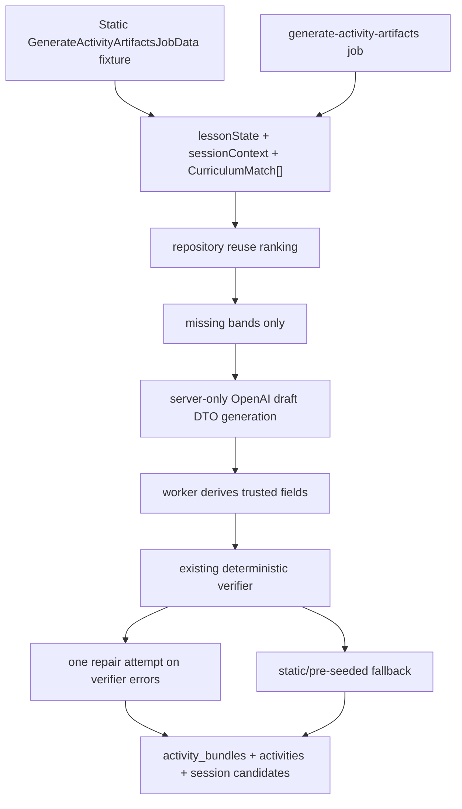

# Area C Plan: RAG-Grounded Generated Activity Artifacts

## Summary

- Standardize MVP artifacts as single-file HTML mini-apps plus a structured manifest. This is best for the agent and for game-like activities because it supports DOM/canvas/SVG interactions without React builds, imports, or bundling failure modes.
- Area C consumes only structured `lesson_state` / whole-session context plus Area B's top-3 `CurriculumMatch[]` results. It must never consume raw transcript.
- The teacher receives three level-specific artifacts: support, core, and challenge. Each is approved individually; if support/challenge is not approved, students in that band receive the approved core activity.
- No manifest-only renderer fallback. Delivery uses verified runnable artifacts only, with pre-seeded artifacts as the D6 fallback.

## Key Interfaces

- Update contracts/docs from the stale JSON-player model to: `ActivityArtifact = manifest + bundle_ref + verifier_scores + evidence`.
- Manifest includes: family, title, difficulty_band, curriculum, est_minutes, content, entry: `index.html`, sdk_version, and allowed_capabilities. `content.items` with answer keys/hints is supported for exercise-shaped artifacts; custom/exploratory artifacts may instead use `description`, `learning_goal`, `success_criteria`, and `telemetry_events`.
- Bundle format: one self-contained `index.html` with inline CSS/JS, no external imports/assets/network. Game-like activities may use DOM, CSS animations, SVG, or canvas.
- Activity SDK lives in `packages/activities` and is exposed to the iframe via `postMessage`: `getManifest()`, `getBand()`, `reportAttempt()`, `reportHint()`, `reportComplete()`.
- Area B contract: `retrieveCurriculumMatches(supabase, { queryText, grade, subject, unit })` returns top-3 `CurriculumMatch[]` results from `@kobi/curriculum`: `objective_code`, `unit`, `grade`, `subject`, `text`, and `similarity`. Area C should use those structured fields directly for grounding and derive teacher-visible artifact evidence from them.
- Area C pre-generation job boundary, transported by `pg-boss` from the worker once a confident lesson state and retrieval result are ready:

```ts
interface GenerateActivityArtifactsJobData {
  sessionId: string;
  lessonState: LessonState; // import from @kobi/ai-core
  curriculumMatches: CurriculumMatch[]; // import from @kobi/curriculum
}
```

Area C owns the job handler and generation pipeline behind this payload; the worker/Area B branch owns when and how the job is enqueued.

## Implementation Flow

- Build a worker-side `session_context` from all `segments.lesson_state` rows in the session: latest topic/objective, accumulated vocabulary, examples used, misconceptions, time remaining, and confidence. Bound it for prompts; do not include transcript text.
- On each confident lesson-state update or objective/topic change, consume the Area C pre-generation job with `sessionId`, `LessonState`, and `CurriculumMatch[]`. Keep the latest verified support/core/challenge artifacts warm for the session; mark older candidates superseded when context changes materially.
- Retrieval-first generation:
  - Query activity repository using session context plus matched curriculum objective.
  - Reuse strong matches, fork/adapt near matches, generate new only when retrieval is weak.
  - Store adapted/new passing artifacts back into the shared repository with `parent_id` for forks.
- Teacher flow:
  - "Hora de actividad" returns the latest verified support/core/challenge artifacts within 60s.
  - Teacher manifest editing is optional for the demo loop. If implemented, teachers may edit manifest content only, not code; edits trigger manifest/schema validation plus a fast smoke check.
  - Approval is per band. Assignment creation resolves `student_profiles.band`; missing/unknown student bands default to core, and missing support/challenge approval falls back to the approved core activity.
- Verifier is two-stage:
  - Deterministic: manifest schema, forbidden API/static checks, sandbox boot, SDK telemetry assertions, and manifest/code consistency smoke test.
  - Rubric model: curriculum alignment, age fit, duration, answer correctness, hint leakage, duplicate risk, and Spanish suitability.
- Sandbox host is owned by Area E:
  - iframe with strict sandbox/CSP, no Supabase credentials inside generated code.
  - parent page injects manifest/assignment/band and binds telemetry writes to parent-owned assignment/student/session context.
  - parent-side telemetry handling validates iframe source, message schema, method allowlist, assignment/student/session authorization, payload size, and rate limits before writing events.
  - crashes or missing telemetry reject the artifact before teacher display.
- Repository ranking should bias toward objective match, embedding similarity over manifest plus code summary, verifier score, times_used, and avg_score.

## Test Plan

- Contract tests for manifest validation and SDK message shapes.
- Worker tests proving RAG queries are built from `session_context`, not transcript, and `CurriculumMatch[]` fields are mapped into artifact evidence without inventing unavailable Area B fields.
- Retrieval tests for reuse, fork/adapt, generate-new, and stale-candidate invalidation.
- Sandbox tests loading seeded and generated HTML, blocking network/storage, verifying boot plus attempt/hint/complete events.
- Telemetry/sandbox tests proving parent-side authorization, payload limits, rate limiting, and parent-owned assignment/student/session binding.
- End-to-end smoke: seeded artifact -> teacher approval -> assignment by band -> student iframe plays -> telemetry row written.
- Demo acceptance: three verified artifacts ready within 60s, at least one reused and one new/forked, and pre-seeded code artifacts survive generation failure.

## Assumptions

- `README.md`, `docs/product-spec.md`, and `docs/contracts.md` are the source of truth for behavior and data shapes.
- MVP uses TypeScript only, Supabase/Postgres/pgvector/Realtime, pg-boss worker jobs, and Spanish UI/activity text.
- Single-file HTML is the MVP artifact format; React or multi-file bundles are post-MVP.
- No manifest-only fallback is implemented.
- Core is the delivery fallback for missing/unknown student bands and unapproved support/challenge bands.

## OpenAI Artifact Generation Plan

Add an OpenAI-backed activity artifact generator that consumes the same structured worker payload already used by Area C, while preserving the existing static/template generator as the D6 fallback. OpenAI generation is server-only, prompt-driven from `prompts/`, and constrained to untrusted draft content. The worker normalizes drafts into complete candidates with server-derived trusted fields, verifies before persistence, and falls back to static/pre-seeded artifacts when generation, repair, caps, or config fail.

### Model And API Choice

- Use the official OpenAI TypeScript SDK only behind a server-only worker boundary, not in shared browser-facing `packages/activities`.
- Configure the generator model with `OPENAI_ACTIVITY_MODEL`; validate the configured model at startup/runtime when OpenAI generation is enabled.
- Optional rubric model is configurable as `OPENAI_ACTIVITY_RUBRIC_MODEL`; do not make pricing claims or model-price comparisons part of acceptance criteria.
- Keep `OPENAI_API_KEY` in env only; update `.env.example` with the variable name, not a real key.

### Data Flow



### Implementation Steps

- Add OpenAI generation module behind the worker/server boundary, for example `apps/worker/src/activity-generation/openaiArtifactGenerator.ts`.
  - Input: same `CreateActivityCandidatesInput` currently used by `packages/activities/src/generate.ts`.
  - Output: raw OpenAI DTO only, for example `{ artifacts: [{ difficulty_band, manifest_draft, index_html }] }`.
  - Explicitly exclude trusted fields from model output: `bundle_ref`, `evidence`, `parent_id`, `source`, `status`, `contract_version`, and `verifier_scores`.
  - Use a strict Zod schema for `{ artifacts: [...] }` so the model cannot return arbitrary wrapper shapes or trusted fields.
- Keep `packages/activities` limited to ActivityArtifact schemas/types, SDK message schemas, verifier, repository ranking, session context helpers, and static `createActivityArtifactCandidates()` fallback.
- Store activity generation and rubric prompt templates under `prompts/`; the worker generator loads them and composes them with minimized `lessonState`, bounded `sessionContext`, and `CurriculumMatch[]`.
  - Require Spanish student-facing text.
  - Require one self-contained `index.html` per band.
  - Allow `custom_interactive` and `exploratory_tool` when a broader mini-app better teaches the objective than a prompt/answer-key exercise.
  - Forbid external imports/assets/network/storage.
  - Require SDK names: `getManifest`, `getBand`, `reportAttempt`, `reportHint`, `reportComplete`.
  - Explicitly state: consume only `lessonState`, bounded `sessionContext`, and `CurriculumMatch[]`; never raw transcript.
  - Redact or minimize quoted classroom phrases that may contain student names/PII before OpenAI calls.
- Refactor `apps/worker/src/jobs/generateActivityArtifacts.job.ts` to choose generation source.
  - Try repository reuse first, as today.
  - For missing bands only, call OpenAI generator when `OPENAI_API_KEY` and model configuration are valid and generation caps allow it.
  - Normalize raw DTOs into complete `ActivityArtifactCandidate`s in the worker: enforce `contract_version`, validate/complete manifest fields, create cryptographically unguessable `bundle_ref`s, derive evidence from `CurriculumMatch[]` only, set `parent_id` from repository fork/adapt context, initialize verifier scores, and leave status finalization to verifier results.
  - Run `verifyActivityArtifact()` on every generated or adapted candidate.
  - If verification fails, send one repair prompt with verifier errors.
  - If repair still fails, OpenAI is unavailable, caps are exceeded, or config is invalid, fall back to `createActivityArtifactCandidates()` and/or pre-seeded verified artifacts.
  - Add job idempotency/deduplication and generation caps per session/class so noisy confident lesson-state updates cannot repeatedly spend tokens.
  - Avoid logging prompts, generated HTML, API keys, student names/PII, or telemetry payloads.
- Add static class-context harness using the exact job data shape in `apps/worker/src/dev/staticActivityContext.ts`.
  - Shape: `{ sessionId, lessonState, curriculumMatches } satisfies GenerateActivityArtifactsJobData`.
  - Add a dev script such as `pnpm --filter @kobi/worker generate:static-artifacts` that prints verified candidates or writes only to a temp/dev path if needed.
- Add mocked server-side generator tests for the worker generation module.
  - Prove valid DTO parsing and normalization into complete `ActivityArtifactCandidate`s.
  - Prove unsafe HTML fails verifier validation before persistence.
  - Prove model-supplied trusted fields are rejected.
  - Prove verifier errors trigger exactly one repair attempt.
  - Prove static fallback is used when OpenAI is unavailable.
  - Prove no raw transcript fields are included in prompt input.
  - Keep live OpenAI calls out of default tests.
- Add at least one worker-level unit/integration test around `generateActivityArtifacts.job.ts`.
  - Prove repository reuse happens first.
  - Prove OpenAI is called only for missing bands.
  - Prove repair then fallback behavior.
  - Prove retries do not duplicate persistence.
- Add telemetry/sandbox tests proving parent-side source validation, schema/method allowlists, assignment/student/session authorization binding, payload-size limits, rate limiting, and event writes from parent-owned context.
- Keep existing validation gates:
  - `pnpm --filter @kobi/activities test`
  - `pnpm --filter @kobi/activities typecheck`
  - `pnpm --filter @kobi/worker typecheck`
  - `pnpm typecheck`

### Spend Controls

- Use one repair retry per candidate at most.
- Deduplicate pending jobs by session/context version.
- Cap generation attempts per session/class before falling back to static/pre-seeded artifacts.
- Keep model choice configurable and validated; pricing is an operational assumption, not an implementation acceptance criterion.
