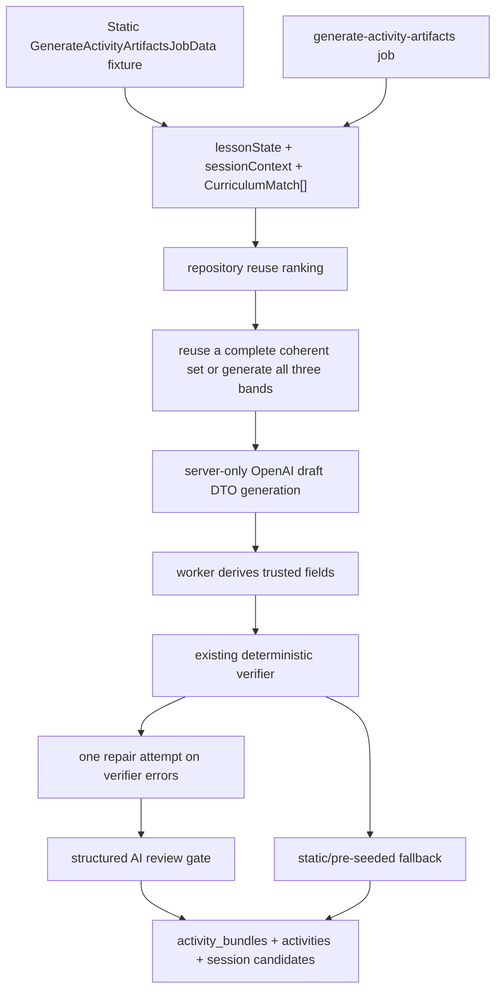

# Area C Plan: RAG-Grounded Activity Artifacts

## Summary

- Standardize MVP artifacts as single-file HTML/CSS/JavaScript mini-apps plus a structured manifest, sourced from repository reuse, an interactive deterministic static fallback, adaptation, or model generation. **The code implements the experience; the manifest owns runtime-editable content.** Interaction patterns are open inside the sandbox; the three historical families (`match_classify`, `sequence_order`, `guided_practice`) are taxonomy exemplars and quality anchors, not a renderer whitelist.
- Generated activities must practice or assess a concrete student ability for the current lesson (identify, organize, produce, justify, compare) through active manipulation — not a boring multi-option / static Q&A worksheet.
- Area C consumes only structured `lesson_state` / whole-session context plus Area B's top-3 `CurriculumMatch[]` results. It must never consume raw transcript.
- The teacher receives three level-specific artifacts: support, core, and challenge. Each is approved individually; if support/challenge is not approved, students in that band receive the approved core activity.
- No manifest-only renderer fallback. Delivery uses verified runnable artifacts only, with pre-seeded artifacts as the D6 fallback.

## Key Interfaces

- Update contracts/docs from the stale JSON-player model to: `ActivityArtifact = manifest + bundle_ref + verifier_scores + evidence`.
- Manifest includes: family (three-value taxonomy exemplar), a required validated free-form snake_case mechanic slug, title, difficulty_band, curriculum, est_minutes, content, entry: `index.html`, sdk_version, allowed_capabilities, plus preserved `learning_design` / `visual_theme` metadata. Teacher-editable content lives only in the manifest (`content.items` prompts, answer keys, hints); the HTML requests manifest/band through the SDK and renders, scores, and hints from the response.
- Bundle format: one self-contained `index.html` with inline HTML/CSS/JavaScript, no React/TSX artifact support, multi-file bundles, external imports/assets/network, or storage. Mini-apps may use DOM, CSS animations, SVG, or canvas and invent classroom tools (sorting boards, timelines, source-check desks, headline workshops, argument builders, etc.).
- Activity SDK lives in `packages/activities` and is exposed to the iframe via `postMessage`: `getManifest()`, `getBand()`, `reportAttempt()`, `reportHint()`, `reportComplete()`.
- Area B contract: `retrieveCurriculumMatches(supabase, { queryText, grade, subject, unit })` returns top-3 `CurriculumMatch[]` results from `@kobi/curriculum`: `objective_code`, `unit`, `grade`, `subject`, `text`, and `similarity`. Area C should use those structured fields directly for grounding and derive teacher-visible artifact evidence from them.
- Area C pre-generation job boundary, transported by `pg-boss` from the worker once a confident lesson state and retrieval result are ready:

```ts
interface GenerateActivityArtifactsJobData {
  sessionId: string;
  lessonState: LessonState; // import from @kobi/ai-core
  curriculumMatches: CurriculumMatch[]; // import from @kobi/curriculum
}
```

Area C owns the job handler and generation pipeline behind this payload; the worker/Area B branch owns when and how the job is enqueued.

## Implementation Flow

- Build a worker-side `session_context` from all `segments.lesson_state` rows in the session: latest topic/objective, accumulated vocabulary, examples used, misconceptions, time remaining, and confidence. Bound it for prompts; do not include transcript text.
- On each ready checkpoint, enqueue `generate-activity-artifacts` with `{ singletonKey: sessionId }`. At execution time, refresh lesson/curriculum via `refreshGenerateActivityArtifactsJobData`, then skip with `skippedReason: "ready candidates are current"` when a full ready trio exists and `hasMaterialContextChange` is false. Keep the latest verified support/core/challenge artifacts warm; supersede older ready candidates when context changes materially.
- Retrieval-first generation:
  - Query activity repository using session context plus matched curriculum objective.
  - Prefer a complete coherent support/core/challenge repository set. Otherwise adapt or generate one full three-band set (no per-band source mixing); all three bands share one family and mechanic.
  - Store new/adapted passing artifacts back into the shared repository with `parent_id` when adapting from a nearest reusable source. Repository and interactive deterministic fallback artifacts use the same contract and gates but do not require model generation.
- Teacher flow:
  - "Hora de actividad" returns the latest verified support/core/challenge artifacts within 60s.
  - Teachers may edit manifest content only, not code; edits trigger schema, escaped-rendering, forbidden-field, manifest/code-consistency, and browser-smoke validation before persistence.
  - Approval is per band. Assignment creation resolves `student_profiles.band`; missing/unknown student bands default to core, and missing support/challenge approval falls back to the approved core activity.
- Verifier is two-stage:
  - Deterministic: manifest schema, forbidden API/static checks, required SDK hooks, rejection of embedded editable manifest values, and manifest/code consistency, followed by required browser smoke under the secured host. The smoke host supplies manifest/band responses, fails on page errors, and must observe valid SDK request/telemetry traffic before persistence.
  - Structured AI review: curriculum alignment, age fit, answer correctness, hint leakage, band coherence, **interactive skill practice (reject static multi-option quiz defaults)**, safety, and usability. The set fails closed when review fails or returns a blocking finding.
- Sandbox host is owned by Area E:
  - iframe with strict sandbox/CSP and no Supabase credentials inside artifact code.
  - parent page answers manifest/band SDK requests and binds telemetry writes to parent-owned assignment context.
  - parent-side telemetry handling validates iframe source, message schema, method allowlist, assignment authorization, payload size, and rate limits before writing events.
  - missing required telemetry hooks reject the artifact before teacher display.
- Repository ranking should bias toward objective match, current lesson-context overlap, verifier score, times_used, and normalized avg_score. Activity embeddings remain optional future work rather than an unwired v0 dependency.

## Test Plan

- Contract tests for manifest validation and SDK message shapes.
- Worker tests proving RAG queries are built from `session_context`, not transcript, and `CurriculumMatch[]` fields are mapped into artifact evidence without inventing unavailable Area B fields.
- Retrieval tests for reuse, generate-new, and stale-candidate invalidation.
- Worker tests for generation state:
  - ready trio + unchanged context → skip (`ready candidates are current`)
  - ready trio + material vocabulary/topic/objective change → regenerate
  - `replace_session_activity_candidates` rejects incomplete != 3-band sets
  - OpenAI claim-before-call quota still enforced after failed/review-rejected attempts
- Prompt/gamePlan tests proving generation input bans static multi-option Q&A defaults and requires an interactive skill-practice metaphor.
- Required browser smoke loads every candidate in the secured host with its supplied manifest/band, fails on page errors, and observes valid SDK traffic before persistence; viewport coverage exercises the supported delivery sizes.
- Telemetry/sandbox tests proving parent-side authorization, payload limits, rate limiting, and parent-owned assignment/student/session binding.
- End-to-end smoke: seeded artifact -> teacher approval -> assignment by band -> student iframe plays -> telemetry row written.
- Demo acceptance: three verified interactive artifacts ready within 60s, including repository/static fallback behavior when model generation is unavailable. A student can manipulate the activity (drag/sort/build/check), not only pick A/B/C.

## Assumptions

- `README.md`, `docs/product-spec.md`, and `docs/contracts.md` are the source of truth for behavior and data shapes.
- MVP uses TypeScript only, Supabase/Postgres/pgvector/Realtime, pg-boss worker jobs, and Spanish UI/activity text.
- Single-file HTML/CSS/JavaScript is the only MVP artifact format. React remains the web host framework and is not an activity artifact format; React/TSX components and multi-file bundles are unsupported.
- No manifest-only fallback is implemented.
- Core is the delivery fallback for missing/unknown student bands and unapproved support/challenge bands.
- Interaction expressiveness is bounded by sandbox/CSP/SDK/verifier, not by a hardcoded family renderer.

## OpenAI Artifact Generation Plan

Add an OpenAI-backed activity artifact generator that consumes the same structured worker payload already used by Area C, while preserving the existing static/template generator as the D6 fallback. OpenAI generation is server-only, prompt-driven from `prompts/`, and constrained to untrusted draft content. The worker normalizes drafts into complete candidates with server-derived trusted fields, verifies before persistence, and falls back to static/pre-seeded artifacts when generation, repair, caps, or config fail.

### Model And API Choice

- Use the official OpenAI TypeScript SDK only behind a server-only worker boundary, not in shared browser-facing `packages/activities`.
- Configure the generator model with `OPENAI_ACTIVITY_MODEL`; validate the configured model at startup/runtime when OpenAI generation is enabled.
- Generated artifacts pass through a separate structured AI review call using the configured activity model; do not make pricing claims or model-price comparisons part of acceptance criteria.
- Keep `OPENAI_API_KEY` in env only; update `.env.example` with the variable name, not a real key.

### Data Flow



### Implementation Steps

- Add OpenAI generation module behind the worker/server boundary, for example `apps/worker/src/activity-generation/openaiArtifactGenerator.ts`.
  - Input: same `CreateActivityCandidatesInput` currently used by `packages/activities/src/generate.ts`.
  - Output: raw OpenAI DTO only, for example `{ artifacts: [{ difficulty_band, manifest_draft, index_html }] }`.
  - Explicitly exclude trusted fields from model output: `bundle_ref`, `evidence`, `parent_id`, `source`, `status`, `contract_version`, and `verifier_scores`.
  - Use a strict Zod schema for `{ artifacts: [...] }` so the model cannot return arbitrary wrapper shapes or trusted fields.
- Keep `packages/activities` limited to ActivityArtifact schemas/types, SDK message schemas, verifier, repository ranking, session context helpers, and static `createActivityArtifactCandidates()` fallback.
- Store activity generation and rubric prompt templates under `prompts/`; the worker generator loads them and composes them with minimized `lessonState`, bounded `sessionContext`, and `CurriculumMatch[]`.
  - Require Spanish student-facing text.
  - Require one self-contained HTML/CSS/JavaScript `index.html` per band that implements an interactive mini-app (manipulative / lab / studio), not a multi-option quiz worksheet.
  - Treat the three families as taxonomy/quality exemplars in prompts; do not describe them as a hard interaction whitelist or renderer selector.
  - Require a shared `gamePlan` metaphor + band skill progression and one shared family/mechanic across all three bands before HTML generation.
  - Forbid external imports/assets/network/storage and React/TSX artifact output.
  - Require SDK names: `getManifest`, `getBand`, `reportAttempt`, `reportHint`, `reportComplete`; bundle code must request manifest/band and use returned editable content rather than embedding prompts, answer keys, or hints.
  - Explicitly state: consume only `lessonState`, bounded `sessionContext`, and `CurriculumMatch[]`; never raw transcript.
  - Redact or minimize quoted classroom phrases that may contain student names/PII before OpenAI calls.
- Interactive mini-app contract (product correction after boring Q&A demos):
  - Default generation must practice a concrete ability tied to the lesson objective.
  - Reject / repair sets that are primarily radio-button, A/B/C, or static prompt→choose-answer flows.
  - Manifest answer keys remain required for verification and teacher review; they describe success criteria, not the UI control type.
  - `mechanic` is already an open, required validated snake_case slug; keep `family` as the three-value exemplar taxonomy for prompting, ranking, reuse, and quality review.
- Refactor `apps/worker/src/jobs/generateActivityArtifacts.job.ts` to choose generation source.
  - Try repository reuse first, as today.
  - Reuse only a complete coherent support/core/challenge repository set. Otherwise call the OpenAI generator once for all three bands when configuration and generation caps allow it.
  - Normalize raw DTOs into complete `ActivityArtifactCandidate`s in the worker: enforce `contract_version`, validate/complete manifest fields, create cryptographically unguessable `bundle_ref`s, derive evidence from `CurriculumMatch[]` only, set `parent_id` from repository nearest-parent context, initialize verifier scores, and leave status finalization to verifier results.
  - Run `verifyActivityArtifact()` on every generated candidate.
  - Preserve model-provided mechanic, learning-design, and visual-theme metadata through normalization while deriving only trusted fields server-side.
  - Run required secured browser smoke with supplied manifest/band and observed SDK traffic after deterministic verification and before persistence.
  - If verification fails, send one repair prompt with verifier errors.
  - If repair still fails, OpenAI is unavailable, caps are exceeded, or config is invalid, fall back to `createActivityArtifactCandidates()` and/or pre-seeded verified artifacts.
  - Add job idempotency/deduplication and generation caps per session/class so noisy confident lesson-state updates cannot repeatedly spend tokens.
  - Avoid logging prompts, generated HTML, API keys, student names/PII, or telemetry payloads.
- Add static class-context harness using the exact job data shape in `apps/worker/src/dev/staticActivityContext.ts`.
  - Shape: `{ sessionId, lessonState, curriculumMatches } satisfies GenerateActivityArtifactsJobData`.
  - Add a dev script such as `pnpm --filter @kobi/worker generate:static-artifacts` that prints verified candidates or writes only to a temp/dev path if needed.
- Add mocked server-side generator tests for the worker generation module.
  - Prove valid DTO parsing and normalization into complete `ActivityArtifactCandidate`s.
  - Prove unsafe HTML fails verifier validation before persistence.
  - Prove model-supplied trusted fields are rejected.
  - Prove verifier errors trigger exactly one repair attempt.
  - Prove static fallback is used when OpenAI is unavailable.
  - Prove no raw transcript fields are included in prompt input.
  - Keep live OpenAI calls out of default tests.
- Add at least one worker-level unit/integration test around `generateActivityArtifacts.job.ts`.
  - Prove repository reuse happens first.
  - Prove OpenAI generates one coherent three-band set rather than mixing sources by band.
  - Prove repair then fallback behavior.
  - Prove retries do not duplicate persistence.
- Add telemetry/sandbox tests proving parent-side source validation, schema/method allowlists, assignment authorization binding, payload-size limits, rate limiting, and event writes from parent-owned context.
- Keep existing validation gates:
  - `pnpm --filter @kobi/activities test`
  - `pnpm --filter @kobi/activities typecheck`
  - `pnpm --filter @kobi/worker typecheck`
  - `pnpm typecheck`

### Spend Controls

- Use one repair retry per candidate at most.
- Deduplicate with pg-boss `{ singletonKey: sessionId }` plus execution-time refresh and `hasCurrentReadyCandidates` skip when context is unchanged.
- Cap OpenAI attempts per session via `claim_openai_activity_generation_attempt` / `OPENAI_ACTIVITY_MAX_GENERATIONS_PER_SESSION` before falling back to static/pre-seeded artifacts. Claim is `service_role`-only.
- Record each OpenAI attempt before the call so failures and review rejections consume the same per-session quota, and publish replacement candidate trios atomically with `replace_session_activity_candidates` under a per-session advisory lock.
- Keep model choice configurable and validated; pricing is an operational assumption, not an implementation acceptance criterion.
