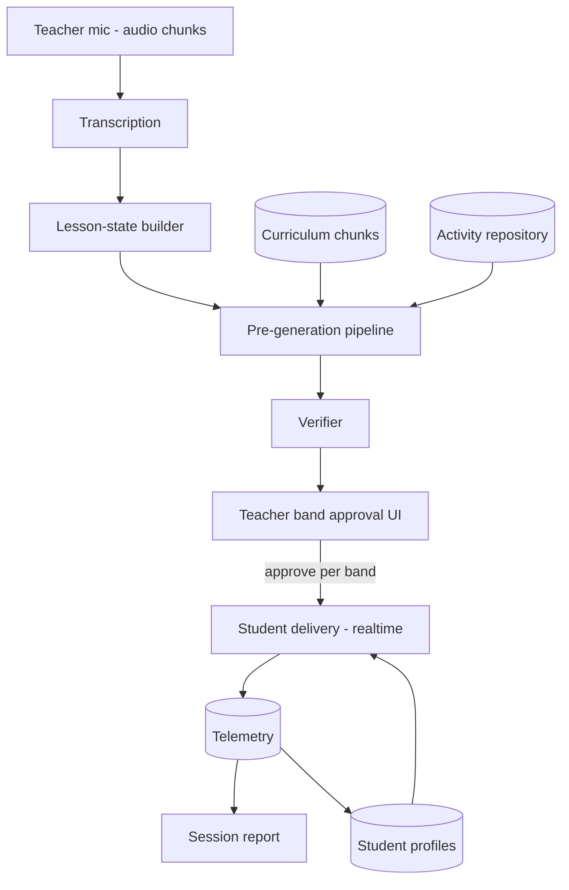

# Kobi MVP v0 — Standalone Product Spec (condensed)

Full source of truth: Notion — "Kobi MVP v0 — Standalone Product Spec" (under Kobi — ai school assistant / hackathon #1).

## MVP Thesis

Kobi v0 turns the last 10 minutes of any class into a personalized, curriculum-grounded activity block — with zero teacher prep. The complete loop: **Listen → Understand → Propose → Approve → Deliver → Measure.** If any of those six stages is mocked, it's not a product.

## In / out of scope (v0)

**In:** one class/grade/subject, 3 activity artifact families, difficulty-banded personalization (support/core/challenge artifacts), plain student experience (activity + hints + results), repository reuse within own content, teacher approval as a hard gate, session report (completion + correctness).

**Out:** multi-school/admin portals, unbounded generative game mechanics outside the verified artifact contract, deep learner modeling, pet companion, cross-school repositories, auto-delivery without review, longitudinal analytics.

## Decision Log

| # | Decision | Rationale |
|---|---|---|
| D1 | Subject: 7th-grade Lenguaje (reading comprehension + vocabulary) | Team owns the Ministry textbooks; avoids math's complex interaction mechanics |
| D2 | REVISED (Jul 4): Activities are verified HTML artifacts + a structured manifest | Supersedes the original "data, not code". Every activity belongs to one of the three v0 artifact families, is delivered as a verified self-contained HTML bundle (`bundle_ref`) in a sandboxed iframe via a small activity SDK, and is paired with a schema-validated JSON manifest (curriculum tags, answer key, hints, est_minutes, variants). The manifest keeps activities storable, verifiable, reusable, and diffable without expanding beyond the three MVP families. |
| D2 | Activity artifacts are verified HTML mini-apps plus manifests | Gate 0 decision on 2026-07-04: v0 uses self-contained HTML/CSS/JS artifacts in a sandboxed iframe, described by a structured manifest and verified before teacher display. This replaces the earlier JSON-player direction. |
| D3 | TypeScript stack: Vite + React frontend, Node API/worker backend | 3 devs, 24 hours, TS-native team. Supabase (Postgres, pgvector, Realtime) gives the same layering as a Python split without adding another language |
| D4 | Personalization v0 = per-session difficulty banding, not learner modeling | Kobi prepares 3 variants (support/core/challenge). The teacher may assign support/challenge to selected students for that session; unselected students receive core by default. |
| D5 | No pet in v0 | Cut for scope; hints stay in the activity artifact manifest/runtime, not the pet; pet is a post-MVP retention layer |
| D6 | Manual fallback at every AI stage | Transcription fails → teacher types 2-line topic summary; generation slow → pull from pre-seeded repository |
| D7 | UI in Spanish, code/docs in English | Salvadoran classroom product |
| D8 | Reaffirmed D3 during repo setup: no Python/FastAPI/uv | LangSmith, OpenAI, and Anthropic all ship first-class TS SDKs covering telemetry/eval needs — a second language/package-manager/deploy-target isn't worth it for a 3-dev, 24-hour build |
| D9 | No legacy JSON activity migration | There are no production JSON activities or consumers yet, so v0 has no legacy compatibility path. Implement the HTML artifact contract directly. |

## System Architecture

3 deployables:
- **Web app (Vite + React)** — teacher portal and student portal. Supabase Realtime pushes assignments and progress.
- **Backend/worker (Node on Railway/Fly)** — API endpoints, transcription, lesson-state builder, pre-generation, verifier. Queue: pg-boss on Postgres.
- **Supabase (Postgres + pgvector + Realtime + Auth)** — all state including embeddings.

## Ownership Areas

| Area | Mission | Contract (in → out) |
|---|---|---|
| A. Listening & Understanding | Turn live classroom audio into a machine-readable picture of what's being taught | mic audio → rolling `lesson_state` |
| B. Curriculum & Retrieval | Make the textbook searchable and match it to the live lesson | textbook unit + `lesson_state` → matching objectives/chunks |
| C. Activity Generation & Quality | Produce classroom-ready, verified activity artifacts grounded in curriculum | `lesson_state` + curriculum chunks + repository → 3 verified candidate `ActivityArtifact`s |
| D. Teacher Experience | Zero-prep control: start session, see understanding, approve with evidence, monitor, review | candidate activities + telemetry → approval decision + session report |
| E. Student Experience & Activity Engine | Deliver activities as a clean, fast student experience, capture telemetry | approved activity + per-session assignment variant → rendered play + telemetry |
| F. Platform & Data Backbone | Shared substrate: identity, storage, realtime delivery, background jobs | every other area reads/writes through it |

Put one name on each area (one person can own two small ones). Agree the shared contracts (`lesson_state`, `ActivityArtifact`, telemetry event — see `docs/contracts.md`) first, then build in parallel.

## Cut Lines (if behind schedule, cut in this order)

1. Live monitor → simple completed-count
2. Support/challenge bands → approved *core* artifact for everyone
3. Live transcription → teacher manual topic entry (this is a feature, per D6, not just a fallback)

**Never cut:** teacher approval gate, verified artifact delivery, curriculum grounding with visible evidence.

## Definition of Done (no-mock test)

- A teacher creates a class and runs a session on real audio with no developer help
- Support/core/challenge curriculum-grounded artifacts appear ≤ 60s after "Hora de actividad"
- Each artifact shows evidence: objective + textbook section + reused/new
- 3+ student devices receive approved banded artifacts and complete them
- The session report reflects real telemetry, not seeds
- Kill the wifi mid-session → manual fallback still completes the loop

## Activity Artifact Decision

HTML activity artifacts are v0, not post-MVP, but they are limited to the three ratified v0 families below. Each candidate activity is a single self-contained `index.html` bundle plus a structured manifest. The bundle runs only inside the sandboxed student iframe, uses no external imports/assets/network, and reports attempts, hints, and completion through the parent-owned SDK over `postMessage`.

The v0 families are:

1. **Match/classify** — vocabulary or concept grouping.
2. **Sequence/order** — process, story, or argument steps.
3. **Guided practice/checkpoint** — short applied questions with hints and feedback.
Seeded runnable artifacts use the same contract and verifier path as generated artifacts. If generation or verification fails, the D6 fallback is a pre-seeded verified artifact, not a manifest-only renderer.

## Implementation status

This section describes repository state; the scope and contracts above remain authoritative.

- **Shipped in code:** teacher/student portals, Supabase data contracts and authorization migrations, audio/manual ingestion, transcription and lesson-state jobs, checkpoint gating, curriculum retrieval, retrieval-first support/core/challenge generation, deterministic artifact verification, teacher approval, authorized sandbox delivery, and attempt/hint/completion telemetry.
- **Partial:** session history UI exists, but the telemetry-backed session report is incomplete: current report surfaces do not yet read `events` and assignment scores to calculate completion and correctness. Live-monitor depth, production-grade browser sandbox smoke automation, real textbook ingestion, and seeded repository breadth are also incomplete.
- **Demo-only:** invented transcript/class/activity inputs under explicitly named demo, development, fixture, and test paths support local walkthroughs; they are not production classroom data.
- **Planned:** telemetry-backed session-report aggregation, deployment manifests, and the eval harness are not implemented. Multi-school administration, learner modeling, pets, cross-school repositories, auto-delivery, and longitudinal analytics remain out of v0 scope.
- **Production-dependent:** the shipped code requires a migrated/configured Supabase project, storage buckets, provider keys, and separately hosted web and worker processes. Repository implementation does not mean the no-mock Definition of Done has been demonstrated in production.
