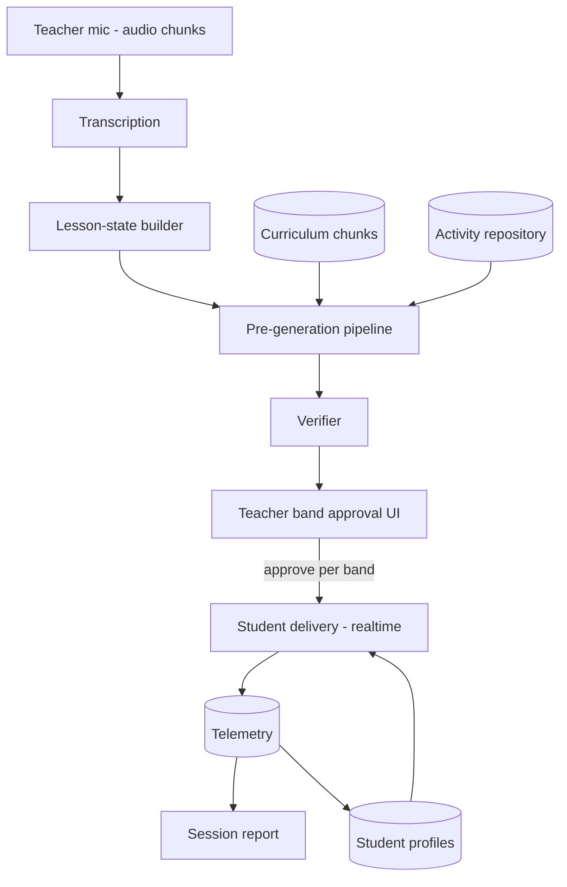

# Kobi MVP v0 — Standalone Product Spec (condensed)

Full source of truth: Notion — "Kobi MVP v0 — Standalone Product Spec" (under Kobi — ai school assistant / hackathon #1).

## MVP Thesis

Kobi v0 turns the last 10 minutes of any class into a personalized, curriculum-grounded activity block — with zero teacher prep. The complete loop: **Listen → Understand → Propose → Approve → Deliver → Measure.** If any of those six stages is mocked, it's not a product.

## In / out of scope (v0)

**In:** one class/grade/subject (7th-grade Lenguaje), a three-value activity-family taxonomy, difficulty-banded personalization (support/core/challenge artifacts), plain student experience (activity + hints + results), model-generated mini-apps by default with repository reuse and an interactive deterministic fallback available in explicit resilient/offline mode, teacher approval as a hard gate, and a session report (completion + correctness). Interaction mechanics are open within the verified sandbox/SDK/verifier contract.

**Out:** multi-school/admin portals, artifact formats other than self-contained HTML/CSS/JavaScript, mechanics that violate the sandbox/SDK/verifier contract, deep learner modeling, pet companion, cross-school repositories, auto-delivery without review, and longitudinal analytics.

## Decision Log

| # | Decision | Rationale |
|---|---|---|
| D1 | Subject: 7th-grade Lenguaje (reading comprehension + vocabulary) | Team owns the Ministry textbooks; avoids math's complex interaction mechanics |
| D2 | Activity artifacts are verified HTML mini-apps plus manifests | Gate 0 decision on 2026-07-04: v0 uses only self-contained HTML/CSS/JavaScript `index.html` artifacts in a sandboxed iframe. React is the web host framework, not an artifact format. Each artifact is paired with a schema-validated manifest and verified before teacher display and persistence. The three family values are a taxonomy and quality exemplars, not a renderer or interaction whitelist; concrete mechanics remain open within the sandbox, SDK, and verifier contract. This replaces the earlier JSON-player direction. |
| D3 | TypeScript stack: Vite + React frontend, Node API/worker backend | 3 devs, 24 hours, TS-native team. Supabase (Postgres, pgvector, Realtime) gives the same layering as a Python split without adding another language |
| D4 | Personalization v0 = per-session difficulty banding, not learner modeling | Kobi prepares 3 variants (support/core/challenge). The teacher may assign support/challenge to selected students for that session; unselected students receive core by default. |
| D5 | No pet in v0 | Cut for scope; hints stay in the activity artifact manifest/runtime, not the pet; pet is a post-MVP retention layer |
| D6 | Manual fallback at every AI stage | Transcription fails → teacher types 2-line topic summary; generation slow → pull from pre-seeded repository |
| D7 | UI in Spanish, code/docs in English | Salvadoran classroom product |
| D8 | Reaffirmed D3 during repo setup: no Python/FastAPI/uv | LangSmith, OpenAI, and Anthropic all ship first-class TS SDKs covering telemetry/eval needs — a second language/package-manager/deploy-target isn't worth it for a 3-dev, 24-hour build |
| D9 | No legacy JSON activity migration | There are no production JSON activities or consumers yet, so v0 has no legacy compatibility path. Implement the HTML artifact contract directly. |

## System Architecture

3 deployables:
- **Web app (Vite + React)** — teacher portal and student portal. Supabase Realtime pushes assignments and progress.
- **Backend/worker (Node on Railway/Fly)** — API endpoints, transcription, lesson-state builder, pre-generation, verifier. Queue: pg-boss on Postgres.
- **Supabase (Postgres + pgvector + Realtime + Auth)** — all state including embeddings.

## Ownership Areas

| Area | Mission | Contract (in → out) |
|---|---|---|
| A. Listening & Understanding | Turn live classroom audio into a machine-readable picture of what's being taught | mic audio → rolling `lesson_state` |
| B. Curriculum & Retrieval | Make the textbook searchable and match it to the live lesson | textbook unit + `lesson_state` → matching objectives/chunks |
| C. Activity Generation & Quality | Produce classroom-ready, verified activity artifacts grounded in curriculum | `lesson_state` + curriculum chunks + repository → 3 verified candidate `ActivityArtifact`s |
| D. Teacher Experience | Zero-prep control: start session, see understanding, approve with evidence, monitor, review | candidate activities + telemetry → approval decision + session report |
| E. Student Experience & Activity Engine | Deliver activities as a clean, fast student experience, capture telemetry | approved activity + per-session assignment variant → rendered play + telemetry |
| F. Platform & Data Backbone | Shared substrate: identity, storage, realtime delivery, background jobs | every other area reads/writes through it |

Put one name on each area (one person can own two small ones). Agree the shared contracts (`lesson_state`, `ActivityArtifact`, telemetry event — see `docs/contracts.md`) first, then build in parallel.

## Cut Lines (if behind schedule, cut in this order)

1. Live monitor → simple completed-count
2. Support/challenge bands → approved *core* artifact for everyone
3. Live transcription → teacher manual topic entry (this is a feature, per D6, not just a fallback)

**Never cut:** teacher approval gate, verified artifact delivery, curriculum grounding with visible evidence.

### Student identity

Teachers create, reset, deactivate, and reactivate durable student accounts from each class roster. Students sign in with a generated username and teacher-selected password. No age, birth date, or guardian data is collected. Pre-account student rows and their assignments remain historical and are excluded from the active roster.

## Definition of Done (no-mock test)

- A teacher creates a class and runs a session on real audio with no developer help
- Support/core/challenge curriculum-grounded artifacts appear ≤ 60s after "Hora de actividad"
- Each artifact shows concise evidence: objective + textbook section
- 3+ student devices receive approved banded artifacts and complete them
- The session report reflects real telemetry, not seeds
- Kill the wifi mid-session → manual fallback still completes the loop

## Activity Artifact Decision

HTML activity artifacts are v0, not post-MVP. Each candidate is a single self-contained `index.html` bundle with inline HTML/CSS/JavaScript plus a structured manifest; React components and multi-file bundles are not supported artifact formats. The bundle runs only inside the sandboxed student iframe, uses no external imports/assets/network/storage, and communicates through the parent-owned SDK over `postMessage`.

The manifest family remains one of three taxonomy and quality exemplars:

1. **Match/classify** — vocabulary or concept grouping.
2. **Sequence/order** — process, story, or argument steps.
3. **Guided practice/checkpoint** — short applied practice with hints and feedback.

These values support prompting, ranking, reuse, and quality review; they do not select a renderer or cap interaction design. `mechanic` identifies the concrete interaction with a required validated free-form snake_case slug (1–64 characters), so mini-apps may invent any mechanic that satisfies the sandbox, SDK, and verifier contract.

For every new or adapted support/core/challenge set, all three bands share one family and mechanic and progress one coherent learning design. Model normalization preserves supplied mechanic, learning-design, and visual-theme metadata while deriving trusted fields server-side. Repository and deterministic static artifacts use the same runnable contract and verifier path as model-generated artifacts, and every fallback must remain genuinely interactive. With model credentials configured, generation defaults to `model_only`: an incomplete or rejected model set produces no candidates instead of a deterministic substitute.

The manifest is the runtime-owned editable content source. The bundle must request the manifest and band through the SDK, then render prompts, evaluate answers, and provide hints from that response; editable prompts, answer keys, and hints must not be duplicated in bundle source. Before persistence, verification must check schema and manifest/code consistency and run the secured HTML in a zero-egress isolated browser sandbox with the supplied manifest/band, fail on page errors, and observe valid SDK traffic. In production this execution boundary is an ephemeral Modal/gVisor sandbox; its diagnostics feed bounded model repair before the final persistence gate.
